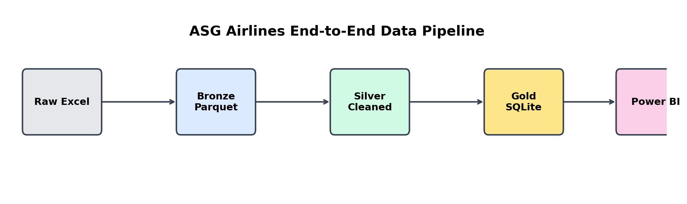

# ✈️ ASG Airlines Data Engineering & Business Intelligence Project

An end-to-end Data Engineering and Business Intelligence project built using **Python, SQL, SQLite, and Power BI**. The project transforms raw airline operational data into interactive executive dashboards through a complete ETL pipeline.

---

## Project Overview

This project simulates a real-world airline analytics solution using the Medallion Architecture (Bronze–Silver–Gold).

### Key Objectives

- Extract raw airline data from Excel
- Perform data profiling and validation
- Clean and standardize datasets
- Build a relational SQLite database
- Design a Star Schema for analytics
- Generate KPIs using SQL & DAX
- Develop 5 interactive Power BI dashboards

---

## Tech Stack

| Technology | Purpose |
|------------|----------|
| Python | ETL Pipeline |
| Pandas | Data Cleaning |
| NumPy | Validation |
| SQLite | Database |
| SQL | KPI Queries |
| Power BI | Dashboards |
| DAX | Measures |
| Git & GitHub | Version Control |

---

## Architecture



---

## Star Schema


---

## ETL Workflow

Raw Excel

↓

Bronze Layer (Extraction)

↓

Silver Layer (Cleaning & Validation)

↓

Gold Layer (SQL KPIs)

↓

Power BI Dashboards

---

## Dashboards

### Executive Overview


### Passenger Analytics


### Flight Operations


### Revenue Analysis


### Business Analytics


---

## KPIs Generated

- Total Revenue
- Total Bookings
- Active Passengers
- Total Flights
- Revenue per Flight
- Average Ticket Value
- Load Factor
- Cancellation Rate
- On-Time Percentage
- Gender Distribution
- Age Group Analysis

---

## Folder Structure

```text
data/
docs/
notebooks/
powerbi/
scripts/
sql/
tests/