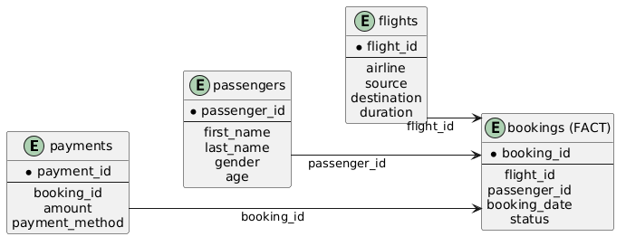
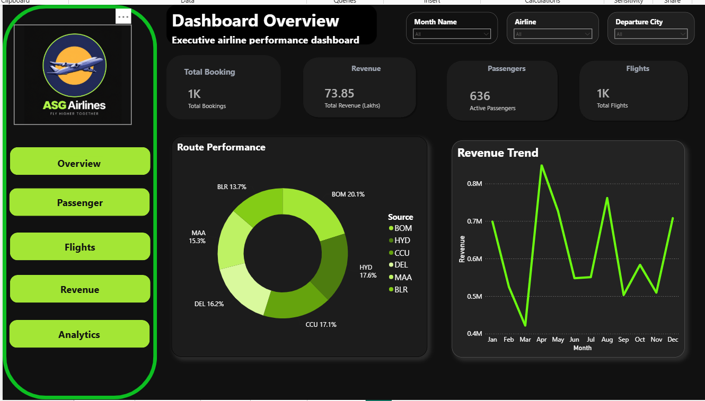
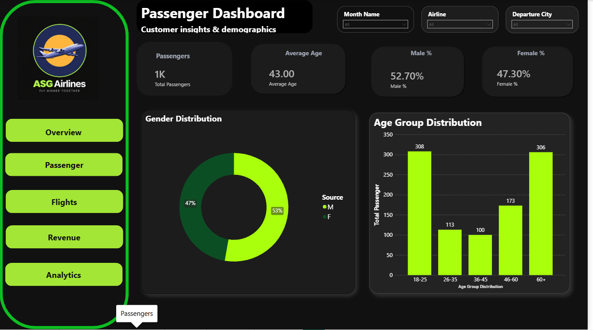
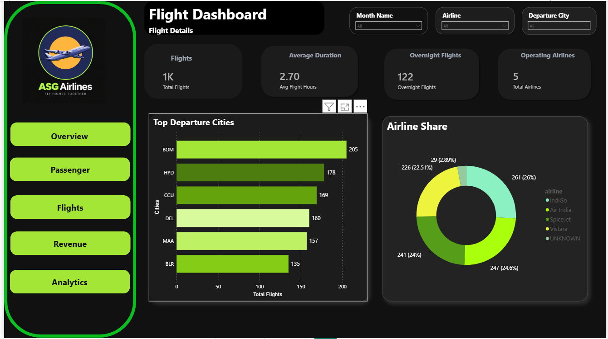
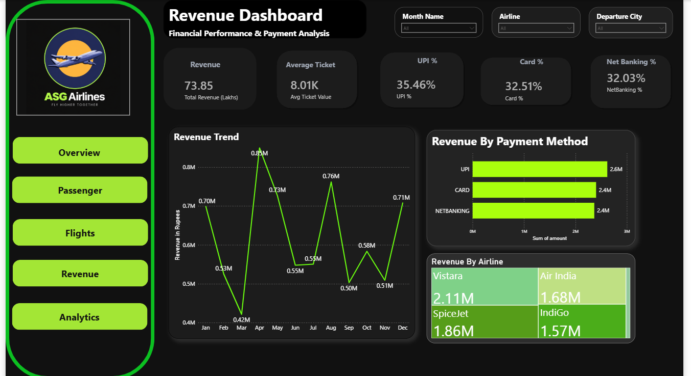
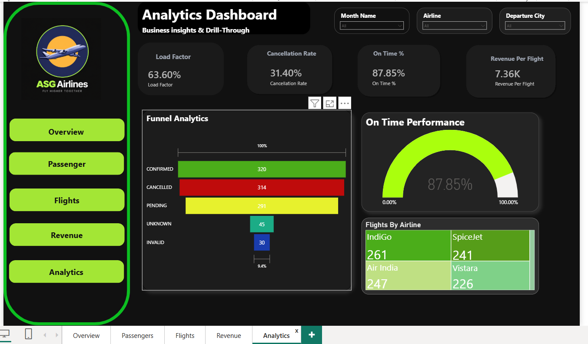

# ✈️ ASG Airlines Data Engineering & Business Intelligence Project

An end-to-end **Data Engineering and Business Intelligence** project built using **Python, Pandas, SQL, SQLite, and Power BI**. This project transforms raw airline operational data into a structured analytical warehouse through a complete ETL pipeline and delivers five interactive executive dashboards for business decision-making.

---

## 📌 Project Overview

This project simulates a real-world airline analytics solution by implementing the **Medallion Architecture (Bronze → Silver → Gold)**. Raw Excel data is extracted, profiled, validated, cleaned, stored in a relational SQLite database using a **Star Schema**, and finally visualized through Power BI dashboards.

### 🎯 Project Objectives

* Extract airline operational data from Excel
* Perform data profiling and quality validation
* Build an automated ETL pipeline using Python
* Design a relational SQLite database
* Implement a Star Schema dimensional model
* Generate business KPIs using SQL & DAX
* Develop 5 interactive Power BI dashboards
* Enable page navigation and dynamic slicer filtering

---

# 🛠 Tech Stack

| Technology           | Purpose                        |
| -------------------- | ------------------------------ |
| **Python**           | ETL Pipeline                   |
| **Pandas**           | Data Cleaning & Transformation |
| **NumPy**            | Data Validation                |
| **SQLite**           | Relational Database            |
| **SQL**              | KPI Queries                    |
| **Power BI**         | Interactive Dashboards         |
| **DAX**              | Business Measures              |
| **Jupyter Notebook** | Development & Profiling        |
| **Git & GitHub**     | Version Control                |

---

# 📂 Project Structure

```text
ASG_Airlines_Project/
│
├── data/
│   ├── raw/
│   ├── bronze/
│   ├── silver/
│   └── gold/
│
├── docs/
│   ├── Data_Flow.png
│   ├── star_schema.png
│   ├── Overview.png
│   ├── Passenger.png
│   ├── Flights.png
│   ├── Revenue.png
│   ├── Analytics.png
│   └── detailed.docx
│
├── notebooks/
│   ├── 01_Data_Profiling.ipynb
│   ├── 02_Ingestion.ipynb
│   ├── 03_Cleaning.ipynb
│   └── 04_SQL_KPIs.ipynb
│
├── powerbi/
│   └── ASG_Airlines.pbix
│
├── scripts/
│   ├── pipeline.py
│   └── validation.py
│
├── sql/
│   ├── create_tables.sql
│   ├── create_views.sql
│   └── kpi_queries.sql
│
├── tests/
│   ├── test_pipeline.py
│   └── test_validation.py
│
├── requirements.txt
└── README.md
```

---

# 🏗 Architecture

The project follows the **Medallion Architecture**, where data quality progressively improves from raw operational data to business-ready analytical datasets.


### Architecture Layers

| Layer        | Description                                               |
| ------------ | --------------------------------------------------------- |
| **Raw**      | Original Excel dataset containing 4 business sheets       |
| **Bronze**   | Data extraction and sheet separation                      |
| **Silver**   | Cleaning, validation, type conversion & duplicate removal |
| **Gold**     | SQL views and KPI-ready datasets                          |
| **Power BI** | Executive dashboards and business analytics               |

---

# ⭐ Star Schema

A **Star Schema** was implemented to optimize analytical performance and simplify business reporting.



### Fact Table

| Table        | Description                                             |
| ------------ | ------------------------------------------------------- |
| **bookings** | Central transactional table containing airline bookings |

### Dimension Tables

| Table          | Description                      |
| -------------- | -------------------------------- |
| **passengers** | Customer demographic information |
| **flights**    | Flight operational details       |
| **payments**   | Revenue and payment information  |

### Relationships

* `passengers (1)` → `bookings (*)`
* `flights (1)` → `bookings (*)`
* `bookings (1)` → `payments (*)`

This dimensional model minimizes redundancy while enabling fast aggregations inside SQL and Power BI.

---

# 🔄 ETL Workflow

```text
Raw Excel Dataset
        │
        ▼
Bronze Layer
(Data Extraction)
        │
        ▼
Silver Layer
(Cleaning & Validation)
        │
        ▼
SQLite Database
        │
        ▼
SQL KPI Layer
        │
        ▼
Power BI Dashboards
```

### ETL Concepts Implemented

* Data Profiling
* Schema Validation
* Duplicate Detection
* Missing Value Handling
* Data Type Conversion
* Feature Engineering
* Primary & Foreign Key Relationships
* Medallion Architecture

---

# 📊 Dashboard 1 — Executive Overview



### KPIs

* Total Bookings
* Total Revenue
* Active Passengers
* Total Flights

### Visuals

* Route Performance (Donut Chart)
* Monthly Revenue Trend
* Interactive KPI Cards
* Dynamic Slicers

### Key Insights

* Processed **1,000 airline bookings**
* Generated **₹73.85 Lakhs** total revenue
* Served **636 active passengers**
* Revenue exhibits noticeable monthly seasonality across the year

---

# 👥 Dashboard 2 — Passenger Analytics



### KPIs

* Total Passengers
* Average Age
* Male %
* Female %

### Visuals

* Gender Distribution
* Age Group Distribution
* Demographic KPIs

### Key Insights

* Average passenger age is **43 years**
* Male travelers account for **52.7%**
* Female travelers account for **47.3%**
* The **18–25** and **60+** age groups represent the largest passenger segments

---

# ✈️ Dashboard 3 — Flight Operations



### KPIs

* Total Flights
* Average Flight Duration
* Overnight Flights
* Total Airlines

### Visuals

* Top Departure Cities
* Airline Market Share
* Operational KPI Cards

### Key Insights

* **Mumbai (BOM)** is the busiest departure hub
* Five airlines contribute nearly equal operational share
* Average domestic flight duration is **2.7 hours**
* **122 overnight flights** were identified

---

# 💰 Dashboard 4 — Revenue Analytics



### KPIs

* Total Revenue
* Average Ticket Value
* UPI %
* Card %
* Net Banking %

### Visuals

* Revenue Trend
* Revenue by Payment Method
* Revenue by Airline Treemap

### Key Insights

* Total revenue reached **₹73.85 Lakhs**
* **UPI** is the most preferred payment method
* **Vistara** contributes the highest airline revenue
* Revenue peaks occur during **April** and **August**

---

# 📈 Dashboard 5 — Business Analytics



### KPIs

* Load Factor
* Cancellation Rate
* On-Time %
* Revenue per Flight

### Visuals

* Funnel Analytics
* On-Time Performance Gauge
* Flights by Airline Treemap

### Key Insights

* On-time performance achieved **87.85%**
* Revenue generated per flight is **₹7.36K**
* Load factor indicates healthy passenger utilization
* Cancellation rate remains approximately **31%**

---

# 📐 DAX KPI Measures

## Executive Overview

```DAX
Total Bookings =
COUNTROWS(bookings)

Total Flights =
DISTINCTCOUNT(flights[flight_id])

Active Passengers =
DISTINCTCOUNT(bookings[passenger_id])

Total Revenue =
SUM(payments[amount])
```

## Passenger Dashboard

```DAX
Average Age =
AVERAGE(passengers[age])

Male % =
DIVIDE(
    CALCULATE(COUNTROWS(passengers), passengers[gender]="M"),
    COUNTROWS(passengers)
)

Female % =
DIVIDE(
    CALCULATE(COUNTROWS(passengers), passengers[gender]="F"),
    COUNTROWS(passengers)
)
```

## Flight Dashboard

```DAX
Avg Flight Hours =
AVERAGE(flights[duration_minutes]) / 60

Overnight Flights =
CALCULATE(
    COUNTROWS(flights),
    flights[is_overnight] = TRUE()
)

Total Airlines =
DISTINCTCOUNT(flights[airline])
```

## Revenue Dashboard

```DAX
Average Ticket Value =
DIVIDE([Total Revenue],[Total Bookings])

UPI % =
DIVIDE(
    CALCULATE([Total Revenue],
        payments[payment_method]="UPI"),
    [Total Revenue]
)

Card % =
DIVIDE(
    CALCULATE([Total Revenue],
        payments[payment_method]="CARD"),
    [Total Revenue]
)

Net Banking % =
DIVIDE(
    CALCULATE([Total Revenue],
        payments[payment_method]="NETBANKING"),
    [Total Revenue]
)
```

## Analytics Dashboard

```DAX
Revenue Per Flight =
DIVIDE([Total Revenue],[Total Flights])

Load Factor =
DIVIDE([Active Passengers],[Total Flights])

On Time % =
DIVIDE([On Time Flights],[Total Flights])

Cancellation Rate =
DIVIDE([Cancelled Flights],[Total Flights])
```

---

# 💡 Overall Business Insights

## Revenue Insights

* Generated **₹73.85 Lakhs** in total revenue.
* Digital payment methods contribute the majority of transactions.
* UPI remains the highest revenue-generating payment channel.
* Vistara leads airline revenue contribution.

## Passenger Insights

* Passenger demographics are almost evenly distributed across gender.
* The average traveler is **43 years old**.
* Young adults (18–25) form the largest customer segment, followed closely by senior travelers.

## Flight Operations Insights

* Mumbai functions as the primary operational hub.
* The airline network is evenly distributed across five carriers.
* Most routes operate within an average duration of **2.7 hours**, indicating a domestic route network.

## Executive Insights

* Interactive slicers allow filtering by **Month**, **Airline**, and **Departure City** across every dashboard.
* Navigation buttons enable seamless drill-through between report pages.
* The Star Schema significantly improves analytical performance by separating facts from dimensions.

---

# 🚀 How to Run

### 1. Clone the Repository

```bash
git clone https://github.com/wahtaj465-dotcom/ASG_Airlines_Data_Engineering_Project.git
cd ASG_Airlines_Data_Engineering_Project
```

### 2. Install Dependencies

```bash
pip install -r requirements.txt
```

### 3. Execute ETL Pipeline

```bash
python scripts/pipeline.py
```

### 4. Open Power BI

Open the following file and refresh the data model:

```text
powerbi/ASG_Airlines.pbix
```

---

# 📖 Documentation

The complete technical documentation, including ETL methodology, architecture, Star Schema design, SQL implementation, DAX measures, and dashboard explanation, is available in:

**`docs/detailed.docx`**

---

# 👨‍💻 Author

**Mohit Ranjan**
**MCA-2025-2027**
*Data Engineering • SQL • Python • SQLite • Power BI • Business Intelligence*

This project demonstrates a complete data engineering workflow, dimensional modeling, SQL analytics, ETL pipeline development, and executive dashboard creation using modern BI practices.
